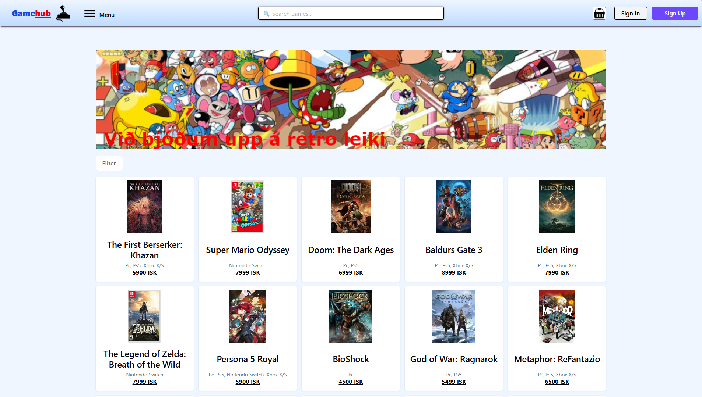

# Lokaverkefni — E-Commerce Web App

A React + TypeScript e-commerce application built with Vite. Features product browsing, shopping cart, Clerk authentication, and Supabase as the backend database.

## Tech Stack

- **React 19** + **TypeScript** — UI and type safety
- **Vite** — build tool and dev server
- **Tailwind CSS** + **Radix UI** — styling 
- **Clerk** — authentication and user management
- **Supabase** — Backend
- **Zustand** — global state management
- **React Router v7** — client-side routing
- **React Hook Form** + **Zod** — form handling and validation

## Prerequisites

- Node.js 18+
- npm

## Getting Started

1. **Clone the repo and install dependencies**

   ```bash
   npm install
   ```

2. **Set up environment variables**

   Create a `.env.local` file in the project root:

   ```env
   VITE_SUPABASE_URL=your_supabase_project_url
   VITE_SUPABASE_PUBLISHABLE_KEY=your_supabase_publishable_key
   VITE_CLERK_PUBLISHABLE_KEY=your_clerk_publishable_key
   ```

3. **Start the development server**

   ```bash
   npm run dev
   ```

   The app runs at `http://localhost:5173` by default.

## Available Scripts

| Command | Description |
|---|---|
| `npm run dev` | Start dev server with hot module replacement |
| `npm run build` | Type-check and build for production |
| `npm run preview` | Preview the production build locally |
| `npm run lint` | Run ESLint |
| `npm run test` | Run unit tests in watch mode (Vitest) |
| `npm run test:run` | Run unit tests once |
| `npm run cy:open` | Open Cypress E2E test runner |
| `npm run cy:run` | Run Cypress E2E tests headlessly |
| `npm run storybook` | Start Storybook component explorer on port 6006 |
| `npm run build-storybook` | Build Storybook as a static site |

## Project Structure

```
src/
├── features/
│   ├── products/      # Product listing, detail, search, retro view, filter sidebar & search dropdown
│   ├── cart/          # Shopping cart & Mini cart (Zustand store with localStorage persist)
│   ├── checkout/      # Checkout flow & Schema
│   ├── order/         # Order confirmation
│   ├── auth/          # Clerk authentication
│   └── adBanner/      # Promotional banner with links to either Home or Retro Page
├── Components/
│   ├── layout/        # App layout wrapper
│   └── ui/            # Shared UI
├── assets/            # Static images (ads, icons, cart, joystick)
├── lib/               # Utility
├── stories/           # Storybook stories
├── test/              # Unit and integration tests
├── App.tsx            # Root component and routes
├── main.tsx           # Entry
├── supabaseClient.ts  # Supabase client setup
└── types.ts           # Shared TypeScript types
```

## Features

- Browse and search products by shop
- Product detail pages
- Search results page with search dropdown
- Filter sidebar for filtering by genre and platform
- Retro-styled alternative product browsing page
- Add/remove items from shopping cart
- Mini cart for quick cart preview without leaving the page
- Clerk-powered sign up, sign in, and protected routes
- Checkout with form validation
- Order completion tracking
- Rotating ad banner linking to home and retro pages
- Responsive design

## Github Pages

[](https://jebj123.github.io/Lokaverkefnid/)


